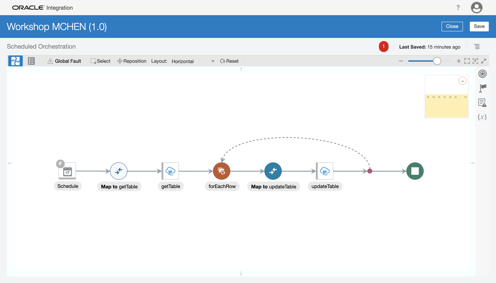

# ATT_WORKSHOP-OIC

This repository houses the materials for the hands-on portion of the workshop.

## Prerequisites

- Set up your workshop user. This consists of clicking the link in your email with subject "Please Reset Your Password for Your atttglobalnetworkservice Account" and ensuring you can log in to cloud.oracle.com (with tenancy name atttglobalnetworkservice).
- Make sure you are able to log in to Oracle Integration Cloud (OIC). Your workshop instructor will provide you the link to the **OIC home page**.
- Once you are able to log in to OIC, make sure you can create a connection and an integration.

With these steps you are good to go!

## Section 1: Connecting to ATP

This section handles the "non-optional" part of the lab. It is our objective to make sure every lab attendee is able to complete this integration.

### **Step 1: Create the ATP Connection**

First, you will need to retrieve the wallet file.
1. Log in to **cloud.oracle.com**.

2. **Click** the hamburger menu Ξ (looks like three stacked horizontal lines) in the upper left corner and select **Autonomous Transaction Processing**.

3. On the left, change the **compartment** to "att_workshop". Then, click on the ATP instance called "ATP_WORKSHOP". _Make sure your region is "US East (Ashburn)" or you will not see the instance._

4. Click the button called **DB Connection**. This will give you a pop-up wizard to download the wallet. Keep the wallet type as "Instance Wallet" and add a password for the wallet. **Remember this password, you will use it to create the connection later in this step.**

Second part of wizard:

Now that you have the wallet file, you can create the connection.
5. Navigate to the integration home page.

6. **Click** the hamburger menu in the upper left corner and select **Integrations**, then **Connections**.

7. **Create** a connection (upper right corner), then after the dialog box pops up, search for "ATP" and select the "Oracle ATP" adapter.

8. In the wizard, give the connection a name, then click **Create**. We recommend that you add your name to the name to differentiate it from connections created by other workshop attendees. Then click **Create**.

9. Perform the following:
  - **Click** the upload button (square button with up arrow) and upload the wallet file you downloaded. This should be the entire zip file.
  - For the **Wallet Password**, type the password you provided when you downloaded the wallet file.
  - For the **Database Service Username**, type "ADMIN".
  - For the **Database Service Password**, your workshop instructor will provide you with the admin password.
  - Finally, right above the security section, for the not-so-optional "Service Name (optional)" enter "atpworkshop_high". _Note: to locate a list of valid service names, unzip the wallet file, then open the tnsnames.ora file._

10. Once you are done with the above, click "Test". The connection should give you a green banner notification, and the connection should show as 100% configured (100% in a blue oval). **Save** your connection.

### **Step 2: Initialize the integration**

This step initializes the integration that you will build on throughout the hands-on portion.
1. **Click** the hamburger menu in the upper left corner and select **Integrations**, then **Connections**.

2. **Create** an integration (upper right corner), then after the dialog box pops up, select "Scheduled Orchestration".

3. In the wizard, give the integration a name, then click **Create**. We recommend that you add your name to the name to differentiate it from integrations created by other workshop attendees. Then click **Create**. _The description is optional, but for your convenience: "This integration queries a table in ATP, then row-by-row modifies the data and updates the table in ATP."_

_Note: for a better integration experience, we recommend you change the layout to "horizontal" and to click the reset button if your integration becomes too messy._

### **Step 3: Invoke ATP to retrieve data**

This step sets up the invocation of ATP to retrieve all data from the instance.
1. Hover your cursor over the grey arrow from the schedule to the stop node, and **click the plus**. Locate the ATP connection you configured. _Stuck? If you were unable to create your connection, please use the "WORKSHOP_ATP_MCHEN" connection._

2. In the wizard, give the invoke a name. These names only have to be unique within the integration, so they can be generic like "getTable". For the **operation to perform**, select "Perform an Operation On a Table", and select "Select". Then click **Next**. _Note: you may also opt to "Run a SQL Statement". This option allows you to customize your query, but is often problematic due to the need to confirm that the query runs properly and the decrease in user control over the result of the query. For these reasons we recommend you to select "Perform an Operation..." for this hands-on exercise._

3. Select "ADMIN" as the **Schema** and **search** for your custom table. Your table is formatted as such: `WORKSHOP_$_#..#` where `$` represents the first initial of your first name (for users with multiple names as the first name, take the first initial of the first word of the first name) and `#..#` represents your last name (for users with multiple names as the last name, all last names are used, separated by underscores). So "Chen, Michael" would be "WORKSHOP_M_CHEN", and "lname1 lname2, fname1 fname2" would be "WORKSHOP_F_LNAME1_LNAME2". ***Alternatively***, you can click **search** with no search parameter and look for a table that bears a close resemblance to your name (they all start with "WORKSHOP_"). Once you have located your provisioned table, you may double-click it or single-click and click the single right chevron to add it to the right side. Then click **Import Tables**. _Stuck? If you cannot find your table or run into an issue importing it, please contact the workshop instructor._

4. There are no actions to perform for this page and the next, but you may view the query being run by scrolling down and clicking **Edit** for the "Review and edit SQL Query" section. Click **Next** to arrive at the summary page, and finally click **Done**.

SQL query:

Summary page:

Your integration should look something like this:

***Save your integration.***

### **Step 4: Update ATP**

This step loops through each item in ATP, then updates the table with the specified operation.
1. Hover your cursor over the grey arrow between "getTable" and the stop node, and **click the plus**. Search for "for each" and click on the "For Each" action.

2. Complete these steps for the for each action:
  - Give the action a descriptive name (for instance, "forEachRow").
  - For the **Repeating Element**, click the `Workshop$#..#` element, and either drag it to the "Repeating Element" box, or click the single right chevron. This item is nested as such: `$getTable -> Workshop$#..#Collection -> Workshop$#..#`. This is also the only element with the **repeatable element** symbol (circled in blue).
  - For the **Current Element Name**, give it a descriptive name (such as "currRow").
Once you are done with the above, click **Create**.

3. Hover your cursor over the grey arrow between "forEachRow" and the stop node. It might help to click **Reset** to re-position all the nodes in the integration. Locate the ATP connection you configured. _Stuck? If you were unable to create your connection, please use the "WORKSHOP_ATP_MCHEN" connection._

4. In the wizard, give the invoke a name (for instance, "updateTable"). For the **operation to perform**, select "Perform an Operation On a Table", and select "Update". Then click **Next**.

5. Select "ADMIN" as the **Schema** and **search** for your custom table, or click **search** with no search parameter and look for a table that bears a close resemblance to your name. See part 3 of step 3 (of section 1) for more information on choosing the table. Once you have located your provisioned table, you may double-click it or single-click and click the single right chevron to add it to the right side. Then click **Import Tables**.

6. Once again, there are no more actions to perform, and the remaining pages are there to show information. Click **Next** and **Done**.

Summary page

Your integration should look something like this:

***Save your integration.***
