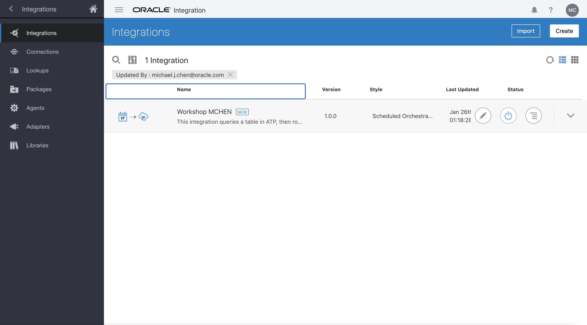
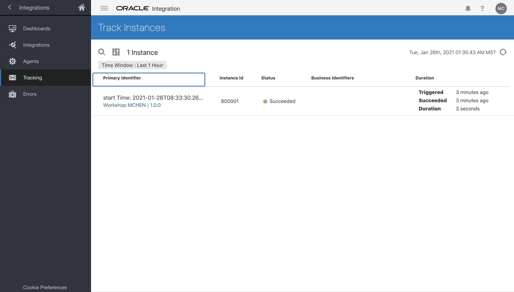
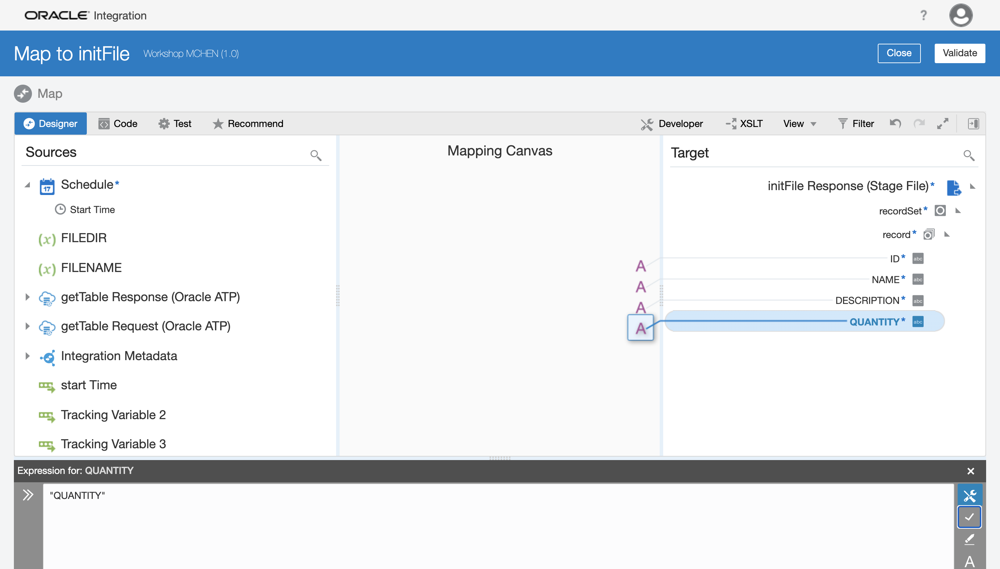
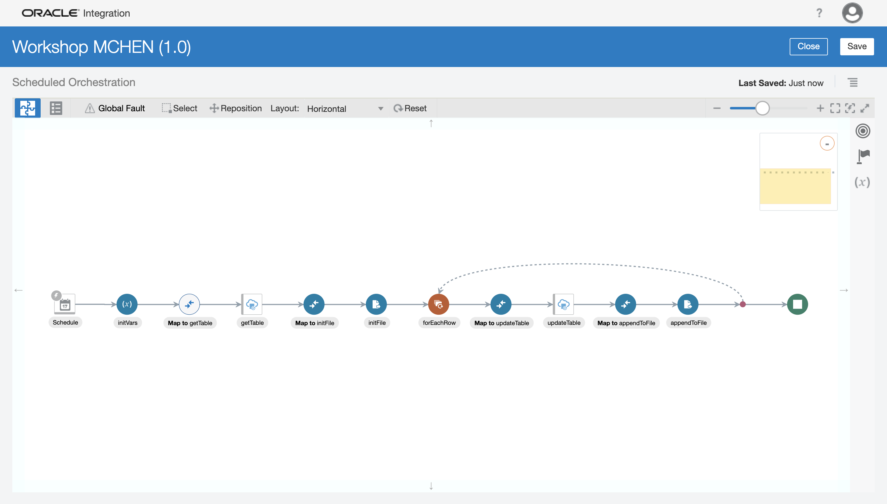
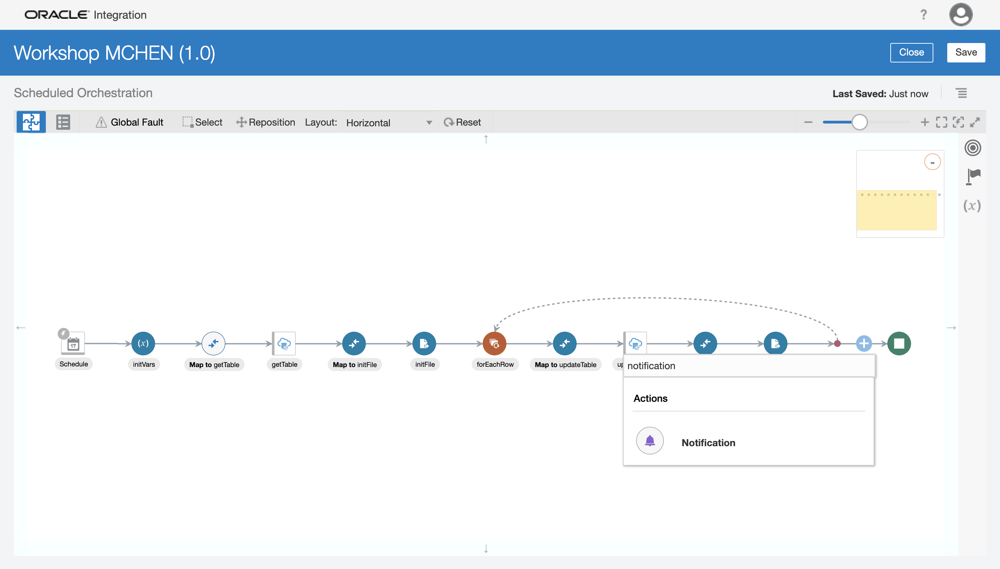

# ATT_WORKSHOP-OIC

This repository houses the materials for the hands-on portion of the workshop. The hands-on portion is organized into **sections** that contain multiple **steps**, with each step containing multiple **parts** (so part 1.3.2 is part 2 of step 3 of section 1).

## Prerequisites

- Set up your workshop user. This consists of clicking the link in your email with subject "Please Reset Your Password for Your atttglobalnetworkservice Account" and ensuring you can log in to cloud.oracle.com (with tenancy name atttglobalnetworkservice).
- Make sure you are able to log in to Oracle Integration Cloud (OIC). Your workshop instructor will provide you the link to the **OIC home page**, and show how to navigate to this home page from within the cloud console (cloud.oracle.com).
- Once you are able to log in to OIC, make sure you can create a connection and an integration. You don't need to actually create these artifacts, you just need to confirm that when you click "Create" you don't receive a yellow banner notification saying "unauthorized" or something similar.

With these steps you are good to go!

## Section 1: Connecting to ATP

This section handles the "non-optional" part of the hands-on workshop. It is our objective to make sure every lab attendee is able to complete this integration.

### **Step 1: Create the ATP Connection**

First, you will need to retrieve the wallet file.
1. Log in to **cloud.oracle.com**.

2. **Click** the hamburger menu Ξ (looks like three stacked horizontal lines) in the upper left corner and select **Autonomous Transaction Processing**.

3. On the left, change the **compartment** to "att_workshop". Then, click on the ATP instance called "ATP_WORKSHOP". _Make sure your region is "US East (Ashburn)" or you will not see the instance._

4. Click the button called **DB Connection**. This will give you a pop-up wizard to download the wallet. Keep the wallet type as "Instance Wallet" and add a password for the wallet. **Remember this password, you will use it to create the connection later in this step.**

Second part of wizard:

Now that you have the wallet file, you can create the connection.
5. Navigate to the integration home page.

6. **Click** the hamburger menu in the upper left corner and select **Integrations**, then **Connections**.

7. **Create** a connection (upper right corner), then after the dialog box pops up, search for "ATP" and select the "Oracle ATP" adapter.

8. In the wizard, give the connection a name, then click **Create**. We recommend that you add your name to the name to differentiate it from connections created by other workshop attendees. Then click **Create**.

9. Perform the following:
  - **Click** the upload button (square button with up arrow) and upload the wallet file you downloaded. This should be the entire zip file.
  - For the **Wallet Password**, type the password you provided when you downloaded the wallet file.
  - For the **Database Service Username**, type "ADMIN".
  - For the **Database Service Password**, your workshop instructor will provide you with the admin password.
  - Finally, right above the security section, for the not-so-optional "Service Name (optional)" enter "atpworkshop_high". _Note: to locate a list of valid service names, unzip the wallet file, then open the tnsnames.ora file._

10. Once you are done with the above, click "Test". The connection should give you a green banner notification, and the connection should show as 100% configured (100% in a blue oval). **Save** your connection.


### **Step 2: Initialize the integration**

This step initializes the integration that you will build on throughout the hands-on portion.
1. **Click** the hamburger menu in the upper left corner and select **Integrations**, then **Connections**.

2. **Create** an integration (upper right corner), then after the dialog box pops up, select "Scheduled Orchestration".

3. In the wizard, give the integration a name, then click **Create**. We recommend that you add your name to the name to differentiate it from integrations created by other workshop attendees. Then click **Create**. _The description is optional, but for your convenience: "This integration queries a table in ATP, then row-by-row modifies the data and updates the table in ATP."_

_Note: for a better integration experience, we recommend you change the layout to "horizontal" and to click the reset button if your integration becomes too messy._


### **Step 3: Invoke ATP to retrieve data**

This step sets up the invocation of ATP to retrieve all data from the instance.
1. Hover your cursor over the grey arrow from the schedule to the stop node, and **click the plus**. Locate the ATP connection you configured. _Stuck? If you were unable to create your connection, please use the "WORKSHOP_ATP_MCHEN" connection._

2. In the wizard, give the invoke a name. These names only have to be unique within the integration, so they can be generic like "getTable". For the **operation to perform**, select "Perform an Operation On a Table", and select "Select". Then click **Next**. _Note: you may also opt to "Run a SQL Statement". This option allows you to customize your query, but is often problematic due to the need to confirm that the query runs properly and the decrease in user control over the result of the query. For these reasons we recommend you to select "Perform an Operation..." for this hands-on exercise._

3. Select "ADMIN" as the **Schema** and **search** for your custom table. Your table is formatted as such: `WORKSHOP_$_#..#` where `$` represents the first initial of your first name (for users with multiple names as the first name, take the first initial of the first word of the first name) and `#..#` represents your last name (for users with multiple names as the last name, all last names are used, separated by underscores). So "Chen, Michael" would be "WORKSHOP_M_CHEN", and "lname1 lname2, fname1 fname2" would be "WORKSHOP_F_LNAME1_LNAME2". ***Alternatively***, you can click **search** with no search parameter and look for a table that bears a close resemblance to your name (they all start with "WORKSHOP_"). Once you have located your provisioned table, you may double-click it or single-click and click the single right chevron to add it to the right side. Then click **Import Tables**. _Stuck? If you cannot find your table or run into an issue importing it, please contact the workshop instructor._

4. There are no actions to perform for this page and the next, but you may view the query being run by scrolling down and clicking **Edit** for the "Review and edit SQL Query" section. Click **Next** to arrive at the summary page, and finally click **Done**.

SQL query:

Summary page:


Your integration should look something like this:


***Save your integration.***

### **Step 4: Update ATP**

This step loops through each item in ATP, then updates the table with the specified operation.
1. Hover your cursor over the grey arrow between "getTable" and the stop node, and **click the plus**. Search for "for each" and click on the "For Each" action.

2. Complete these steps for the for each action:
  - Give the action a descriptive name (for instance, "forEachRow").
  - For the **Repeating Element**, click the `Workshop$#..#` element, and either drag it to the "Repeating Element" box, or click the single right chevron. This item is nested as such: `$getTable -> Workshop$#..#Collection -> Workshop$#..#`. This is also the only element with the **repeatable element** symbol (circled in blue).
  - For the **Current Element Name**, give it a descriptive name (such as "currRow").
Once you are done with the above, click **Create**.

3. Hover your cursor over the grey arrow between "forEachRow" and the stop node. It might help to click **Reset** to re-position all the nodes in the integration. Locate the ATP connection you configured. _Stuck? If you were unable to create your connection, please use the "WORKSHOP_ATP_MCHEN" connection._

4. In the wizard, give the invoke a name (for instance, "updateTable"). For the **operation to perform**, select "Perform an Operation On a Table", and select "Update". Then click **Next**.

5. Select "ADMIN" as the **Schema** and **search** for your custom table, or click **search** with no search parameter and look for a table that bears a close resemblance to your name. See part 3 of step 3 (of section 1) for more information on choosing the table. Once you have located your provisioned table, you may double-click it or single-click and click the single right chevron to add it to the right side. Then click **Import Tables**.

6. Once again, there are no more actions to perform, and the remaining pages are there to show information. Click **Next** and **Done**.

Summary page

7. Select the **Map to updateTable**, and click on the pencil icon to **edit** the mapper.

8. On the left hand side (LHS), expand **currRow** until you see the four variables (id, name, etc.), and on the right hand side (RHS), expand `Workshop$#..#` until you see the four variables. Drag the LHS variables to their RHS counterparts.

9. Now, you will have a little freedom. In this part, you will make a change to the data being uploaded. We will show two ways to modify the data, but you may experiment with other methods later. You may add both of these modifications to the data (and more) if you wish. If you wish to make other modifications, do not modify the ID column, as that is the primary key for this table.
  - Method 1: string concatenation. Click on **description** on the RHS, then click the edit icon under the x in the bottom editor box (looks like a screwdriver crossed with a wrench<!--the OIC sickle and star-->). In front of the contents (before the $ sign), type `concat(`, and after the whole string, type `, ".")`. The full string might look something like `concat($currRow/nsmpr0:WorkshopMChen/nsmpr0:description, ".")`. This concatenates a period / full stop at the end of the current description. Click the check mark to the right of the editor box to validate this string.
  
  - Method 2: numeric calculation. Click on **quantity** on the RHS, then click the edit icon. At the end of the whole string, add `+1`. This increments the current quantity by 1. Click the check mark to validate this string.
  
  For more methods of data modification, you can click the components button near the upper right corner (looks like box with a small right arrow, circled in red) which opens up a list of functions and operators you can use in the mapper. **This is also where you can find functions defined in libraries you uploaded**.
  
10. Once you have completed the modification to the data, click **Validate** at the top right of the screen, then **Close**.


Your integration should look something like this:


***Save your integration.***

### **Step 5: Activate integration**

This step goes through the process of activating and testing integrations.
1. First, you will need to resolve any errors that are present in the integration. You can see how many errors/warnings there are by a red/blue circled number next to "Last Saved". If you performed all the steps correctly, you should only see a red circled 1. You can click the circle to view the error and hover over the single entry to view the error.

2. This error is resolved by **enabling a tracking variable** for the integration. Click the menu under the save button and select **Tracking**.

3. Expand the "schedule" variable, and drag the "startTime" variable over the first "Drag a trigger field here". Instead of dragging you can also click the "startTime" variable and click the single right chevron. Click **Save**.

4. Now your integration is ready for activation. **Save your integration**, then click **Close**. This brings you back to the integration home screen, and you can see that your status has changed from "Draft" to "Configured". Hover your cursor over your integration and click the "Power Button".

5. In the dialog box, check the box for "Enable Tracing", and also the box for "Include Payload". Then click **Activate**. _Note: these boxes are generally only checked when testing an integration, as they tend to reveal sensitive/confidential information. Also, here we could create a schedule if we wanted to, but as we will never use it it is simpler to skip that step._


Now your integration is active, and you can run it to perform business operations. <!--The world of tech is at your fingertips!!-->

### **Step 6: Run and monitor integration**.

This step shows how to manually trigger an integration and how to debug integrations.
1. Hover your cursor over your integration and click the "Play Button". Then click **Submit Now**.

2. Click **Submit Now**.<!--OIC repeats everything twice, for a premier "Are you sure????? ?????" experience-->

3. Now, the integration will run and either complete or throw an error during execution. To view the "job" that was just initiated, navigate back to the integration home page, then go to **Monitoring** > **Integrations** > **Tracking**.

4. In this page, you will see integrations that have completed execution in the given time frame (default is last hour). It is likely that your integration has already executed and given a success or error. Drill down into the integration run by clicking on the black text (here it is "start Time: 2021-...").

5. In this page, you will see the execution pathway highlighted in green. For most integrations, the structure is linear enough that it is not really interesting to look at (unless there is an error), but the green pathway is useful for complex integrations that use branching logic and "fault handlers" (basically try-catch code block). The 3 on the for each block means the for each loop executed 3 times.

6. Now you will take a look at the activity stream. Click the menu icon under the "Close" button in the upper right corner, and select **View Activity Stream**. You can click on the messages to view the payloads that were sent (enabled by checking the "Include Payload" option when activating the integration). _Note: should this integration run have resulted in an error, at the end of the activity stream it will show the error message. If you ran into one of these, please contact your workshop instructor for specific debugging._


That's it! For some of you, you will have built your first integration on Oracle Integration Cloud!<!--The first of many, hopefully-->

## Section 2: Sending a notification and building a file

This section is optional, and it builds on section 1. Attendees who complete section 1 are strongly encouraged to move on to this section and finish as much of it as they can.

### **Step 1: Initialize file and variables**

In this step, you will create a file in OIC and make use of variables in your integration to simplify the workflow. **Important: you must deactivate your integration before you begin this step. To do so, find your integration and click the "power button" to deactivate it.**
1. In your integration, hover your cursor over the grey arrow between "Schedule" and "Map to getTable". Search for "assign" and select the **Assign** action. In the dialog pop up box, give it a name (for instance "initVars") and click **Create**.

2. Click the lower-right plus to add a variable. **Change** the "initVars_assignment_1" variable name to `FILENAME`. Then, click the pencil icon to give this variable a value. For the Expression, you will simply write `"workshop.csv"`, quotation marks included. _Make sure the quotation marks are "unformatted", i.e. not the so-called “smart quotation marks”._ Add another variable called `FILEDIR` with value `"/"`. Once you are done, click **Close**.

3. Hover your cursor over the grey arrow between "getTable" and "forEachRow". Search for "stage file" and select the **Stage File** action.

4. In the wizard, give the action a name, for instance "initFile", and click **Next**.

5. **Choose** the **Stage File Operation** to be **Write File**. For the **file name**, click the pencil icon, and drag `$FILENAME` to the expression box (or use the chevron). Then click **Save** and **Exit Expression Builder**. Do the same thing for **output directory**, except using the variable `$FILEDIR` this time. Then click **Next**.

Editing the expression for the file name and output directory:

6. Ensure that you want to specify the structure of the contents of the file as CSV, then click **Next**.

7. For the **delimited data file**, choose [workshop.csv](workshop.csv), which is located in this git repository. The **record name** should be "record", and the **recordset name** should be "recordSet". _But like most other names, there is no restriction for these names._ Then click **Next**.

8. Click **Done**.

9. Select the **Map to initFile** node, and click the pencil icon to **edit** the mapper.

10. On the RHS, **expand** recordSet and record. For each of the four variables, right-click on them and select **Create Target Node**. This allows you to edit the expression for this variable without using a LHS variable. Edit the expression (clicking the wrench-screwdriver icon) and enter the variable name in quotes, so for `ID` the expression would be `"ID"`, etc. Once this is done, **Validate** and **Close** the mapper.


Your integration should look something like this:


***Save your integration.***

### **Step 2: Append to file**

In this step, you will append data to the file you just initialized.
1. Hover your cursor over the grey arrow right after "updateTable", and choose the **Stage File** action.

2. In the wizard, give the action a name, for instance "appendToFile", and click **Next**.

3. Choose "Write File" for the **Stage File Operation**, and follow the same steps in part 5 for the file name and output directory. **Check the box for "Append to Existing File".** Then click **Next**.

4. As before, make sure it is specifying CSV as the file format. Click **Next**.

5. As before, choose [workshop.csv](workshop.csv), which is located in this git repository. The **record name** should be "record", and the **recordset name** should be "recordSet". Then click **Next**.

6. Click **Done**.

7. Select the **Map to appendToFile** node, and click the pencil icon to **edit** the mapper.

8. Expand the RHS variables as before, and also expand **currRow** to the column variables on the LHS. Perform the same mapping as in the mapping to update the rows (see parts 7-10 of step 4 of section 1), then **Validate** and **Close**. _Note: to import the map xsl, you need to export the integration, then unzip the downloaded .iar file and locate the relevant mapper. As such a map does not yet exist, you will unfortunately have to re-create it. Fortunately the changes to make should not be too complex._


Your integration should look something like this:


***Save your integration.***

### **Step 3: Send an email notification**

In this step, you will configure OIC to send you the file you just built.
1. Hover your cursor over the grey arrow pointing to the stop node (at the very end). Search for "notification, then select **Notification**. Give it a name, for instance "sendEmail", then click **Create**.

2. Write an email, OIC style:
  - For the **sender**, click the pencil icon and type `"no-reply@oracle.com"`.
  - For the **recipient**, click the pencil icon and type your email surrounded by quotes.
  - For the **subject**, click the pencil icon and enter something descriptive surrounded by quotes, such as `"ATT Workshop: integration run"`.
  - For the **attachments**, click the plus icon and search for "FileReference". There should only be one such "FileReference", for instance nested under `$initFile > *WriteResponse > *WriteResponse > ICSFile > *FileReference`. _Note: even though this file reference comes from the "initFile" action, which comes before the appendToFile action, the data is modified before the email notification is fired, so the file will include all of the data processed by the foreach loop._
  - For the **body**, enter this text:
```
Integration successfully executed.

Instance ID: {instanceId}
Invoked by: {invokedBy}

See attached file for integration results.
```
  _Note: you can write the email in HTML. You can view an example of an HTML email (with variables) [here](email.html)_
  - For the **email parameters**, click the + and rename it to "instanceId". Click the pencil icon to edit the value of the parameter, and search for "instanceId" (there should only be one).
  - Add another parameter for "invokedBy", searching for "invokedBy" (there should only be one).


Your integration should look something like this:


***Save your integration.***
